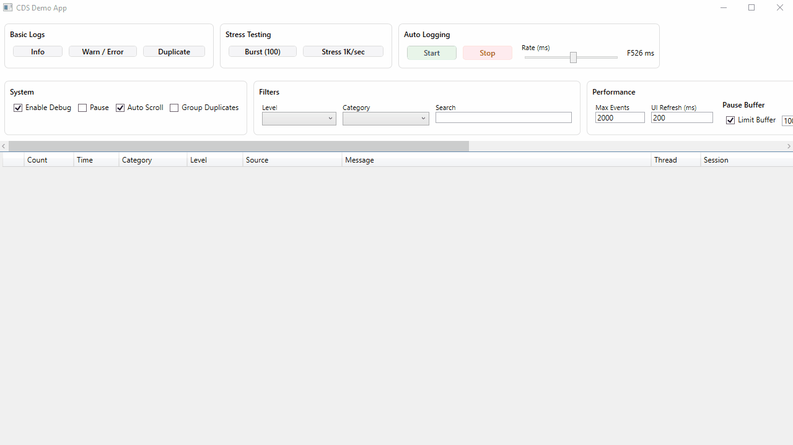
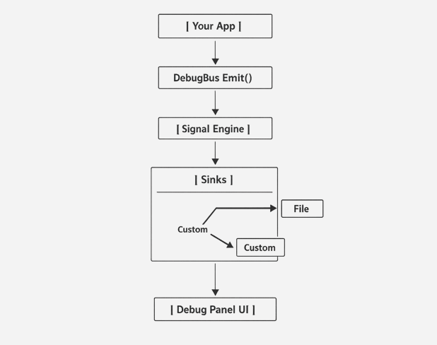

# 🚀 CDS — Central Debug System

[](https://www.nuget.org/packages/CDS.Core)
[](https://www.nuget.org/packages/CDS.Wpf)


> A structured, real-time debug signal system for .NET — designed to replace noisy logs with meaningful, actionable signals.

---

## 🎥 Live Demo



---

## 🧭 Why CDS Exists

Debugging modern applications is inefficient:

- ❌ Visual Studio Output is cluttered  
- ❌ Logs are unstructured and noisy  
- ❌ Important signals get buried  
- ❌ AI tools struggle to identify real issues  

---

## ⚔️ Why not Serilog / ILogger?

CDS is **not competing** with traditional logging frameworks.  
It solves a different problem.

| Feature                     | Serilog / ILogger        | CDS                          |
|----------------------------|--------------------------|-------------------------------|
| Purpose                    | Logging                  | Debug signal system           |
| Output                     | Files / Console          | Real-time UI + signals        |
| Structure                  | Text-first               | Event-first (structured)      |
| Real-time visualization    | ❌ No                    | ✅ Built-in UI                |
| Debug workflow             | Passive                  | Interactive                   |
| Signal grouping            | ❌ No                    | ✅ Yes (xN aggregation)       |
| Pause & inspect            | ❌ No                    | ✅ Yes                        |
| AI-friendly                | ⚠️ Limited               | ✅ Designed for AI            |

---

### 💡 Use CDS *with* your logger

CDS is not a replacement—it’s a **layer above logging**.

```csharp
Log.Information("User logged in");

DebugBus.Emit("Auth", DebugLevel.Info, "User logged in");
````

👉 Logs are for storage
👉 CDS is for **understanding behavior in real-time**

---

## ✅ What CDS Gives You

CDS transforms your application into a **signal-driven system**:

* Emit **clean, structured debug signals**
* Route them to **UI, file, or custom sinks**
* **Filter, group, and analyze** in real-time
* Build your own **debug language (DebugEvents)**

---

## ⚡ Quick Example

```csharp
DebugBus.Emit("System", DebugLevel.Info, "App Started");
DebugBus.Emit("Rendering", DebugLevel.Warning, "Image too large");
```

👉 Instantly visible in Debug Panel UI or file logs.

---

## 📦 Installation

### .NET CLI
```bash
dotnet add package CDS.Core
dotnet add package CDS.Wpf
````

### Package Manager

```powershell
Install-Package CDS.Core
Install-Package CDS.Wpf
```

---

## 🚀 60-Second Setup (Deterministic)

This is the **ONLY required wiring**.

---

### 🔹 STEP 1 — Enable CDS (App.xaml.cs)

```csharp
protected override void OnStartup(StartupEventArgs e)
{
    base.OnStartup(e);

    DebugConfig.Enabled = true;

    var fileSink = new FileDebugSink();
    DebugBus.RegisterSink(fileSink);

    DebugBus.Emit("System", DebugLevel.Info, "CDS Initialized", "App");
}
```

---

### 🔹 STEP 2 — Flush on Exit (IMPORTANT)

```csharp
protected override void OnExit(ExitEventArgs e)
{
    fileSink?.Stop();
    base.OnExit(e);
}
```

---

### 🔹 STEP 3 — Add Debug UI (ANYWHERE)

```xml
xmlns:cds="clr-namespace:CDS.Wpf.Views;assembly=CDS.Wpf"

<cds:DebugPanelView />
```

👉 No binding. No setup. No configuration.

---

### 🔹 STEP 4 — Emit Signals (Anywhere in App)

```csharp
DebugBus.Emit("UI", DebugLevel.Info, "Button clicked", "MainWindow");
```

---

## 🎯 That’s It

If you did the 4 steps above:

* ✅ UI works
* ✅ File logging works
* ✅ Thread-safe pipeline works
* ✅ Zero regression with internal CDS behavior

---

## 🧠 Core Concepts

---

### 🔷 DebugBus (The Heart)

```
Your App → DebugBus → Sinks → UI / File / Custom
```

---

### 🔷 Debug Signal

A meaningful event—not a log line.

```csharp
DebugBus.Emit("Data", DebugLevel.Error, "Invalid input");
```

---

### 🔷 DebugEvent (Advanced)

```csharp
DebugBus.Emit(new DebugEvent
{
    Category = "Rendering",
    Level = DebugLevel.Verbose,
    Message = "Rasterizing",
    Source = "Renderer",
    SubCategory = "Pipeline",
    Data = new Dictionary<string, object>
    {
        ["Row"] = 10
    }
});
```

---

### 🔷 DebugLevel

| Level   | Meaning               |
| ------- | --------------------- |
| Info    | Normal signal         |
| Warning | Potential issue       |
| Error   | Failure               |
| Verbose | High-detail debugging |

---

### 🔷 Sinks

Outputs of the system:

* UI (auto-connected via CDS.Wpf)
* File (`FileDebugSink`)
* Custom (`IDebugSink`)

---

## 🖥️ UI (CDS.Wpf)

### Add Once — Works Forever

```xml
<cds:DebugPanelView />
```

---

### Features

* 🔴 Real-time debug stream
* 🟡 Filtering (level, category, text)
* 🔵 Duplicate grouping (xN)
* ⚡ Auto-scroll (optimized)
* 🧠 Structured event visualization
* 🧵 Thread-safe pipeline (safe under stress)

---

### ⏸️ Pause Behavior (Important UX Detail)

CDS does **NOT destroy signals on pause**.

Instead:

* ⏸️ UI rendering pauses
* 📦 Signals are buffered internally
* ▶️ On resume → replayed in chronological order

👉 This ensures **zero data loss + perfect debugging continuity**

---

## 🔧 Advanced Usage

---

### Structured Events

```csharp
DebugBus.Emit(new DebugEvent
{
    Category = "Network",
    Level = DebugLevel.Info,
    Message = "API Response",
    Data = new() { ["Status"] = 200 }
});
```

---

### Throttling (High Frequency Protection)

```csharp
if (DebugThrottle.ShouldLog("render-loop", 200))
{
    DebugBus.Emit(...);
}
```

---

### Custom Sink

```csharp
public class MySink : IDebugSink
{
    public void OnEvent(DebugEvent e)
    {
        // Send to API / DB / telemetry
    }
}
```

---

## 📁 Log Storage

```
%LOCALAPPDATA%\CDS\
```

---

## 🧠 Architecture Overview



---

## 🏗️ Architecture

```
Application
   ↓
DebugBus
   ↓
Sinks
   ↓
UI / File / Custom Outputs
```

---

## 🧭 Best Practices

* ✔ Use meaningful categories (`UI`, `Rendering`, `Data`, `Network`)
* ✔ Log signals, not noise
* ✔ Focus on state changes, decisions, failures
* ✔ Use structured events for complex flows
* ✔ Use throttling for loops

---

## 📦 Package Structure

### 🔷 CDS.Core

* DebugBus
* DebugEvent
* DebugConfig
* DebugThrottle
* IDebugSink

---

### 🔷 CDS.Wpf

* DebugPanelView
* DebugCollectorService
* DebugPanelViewModel
* FileDebugSink

---

## ❓ FAQ

---

### Do I need CDS.Wpf?

No. UI is optional.

---

### Does UI require setup?

No. It auto-connects.

---

### Is file logging automatic?

No. Register `FileDebugSink`.

---

### Where should I configure CDS?

👉 ONLY in:

```
App.xaml.cs
```

This keeps integration deterministic.

---

### Will this break my app?

No.

CDS is:

* Non-blocking
* Thread-safe
* Passive (does not interfere with logic)

---

## 🔥 Core Idea

> CDS is not a logger.
> It is a **Debug Signal Infrastructure Engine**.

---

## 📄 License

MIT

---